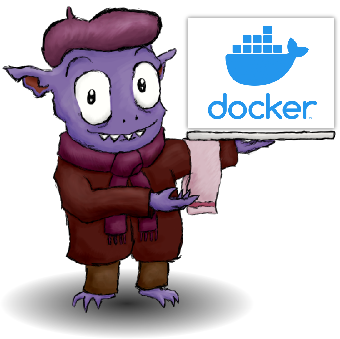

 
 [](https://jenkins.cronocide.net/job/git.cronocide.net/job/mediagoblin-docker/job/master/)

# mediagoblin-docker
A ready-to-use [MediaGoblin](https://mediagoblin.org/) container built according to [the recommended installation](https://docs.mediagoblin.org/en/stable/siteadmin/deploying.html) guidelines.

*_Note: This is NOT an official MediaGoblin container. There wasn't one when I created this, which is why I created it._*

## Security

This container is infrequently built, and the mediagoblin source is infrequently maintained. It would be unwise to put this container on the internet without a good WAF and possibly and SSO solution. There is no security reporting for this software and this container is fully featured. This container could easily become a platform for pwning yourself if you don't know what you are doing.

When in doubt, don't put this container on the internet, at all.

## Volume mappings

Map your desired media folder location to the `/data` directory:

```sh
docker run -v ~/Desktop/media:/data mediagoblin-docker
```

## Configuration

Mediagoblin is configured through `mediagoblin.ini` which lives at `$MEDIAGOBLIN_CONFIG`. It is created if it does not exist when the container starts. This file contains all the configuration for Mediagoblin. Some of the important configuration items that need set up are listed below. For a full list of configuration options, see [the configuration spec](https://git.sr.ht/~mediagoblin/mediagoblin/tree/master/item/mediagoblin/config_spec.ini). I highly recommend a thorough read through of these options if considering a production deployment.

### [DEFAULT]

`data_basedir` *_(Required)_* : The data directory to story media uploaded to Mediagoblin at. This *must* be set to `/data/` to match what is in `paste.ini`, or else you will get `404`'s when trying to access uploaded content.

### [mediagoblin]

`sql_engine` : The URL for the database. Supported URLs start with `sqlite://` and `postgres://`. *Importantly, no database (sqlite or otherwise) is created for you by default. This will need to be changed before use.*

`allow_registration` : Allow users to register on the site. `True` by default.

`show_tos` : Show Terms of Service. `False` by default.

### [jinja2]

`extensions` : Additional Jinja extensions to enable. Empty by default.

### [media:medium]

`max_width` : The max width of images when creating display images. `640` by default.

`max_height` : The max height of images when creating display images. `640` by default.


## Environment Variables

When running this container the follwing environment variables must be set:

`BIND_PORT` *_(Optional)_* : The port to expose mediagoblin at. `6543` by default.

`MEDIAGOBLIN_CONFIG` *_(Optional)_* : The path to `medigoblin.ini` in the config. `/data/mediagoblin.ini` by default.

`ADMIN_USERNAME` *_(Required)_* : The username of the admin user.

`ADMIN_EMAIL` *_(Required)_* : The email address of the admin user.

`ADMIN_PASSWORD` *_(Required)_* : The password of the admin user.

## Building

To build a copy of the container yourself, optionally set the container username and UID with the build args `USER_NAME` and `USER_UID`. The defaults are `mediagoblin` and `999` respectively. The branch of mediagoblin to build can be specified with `BUILD_BRANCH`. It is `stable` by default.

```sh
cd mediagoblin-docker
docker build -t mediagoblin .
```
